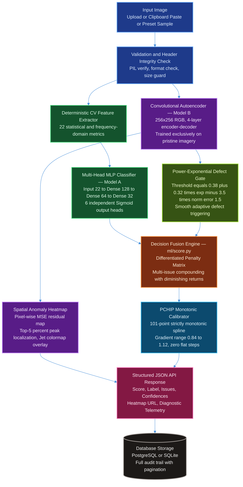

# AI Image Quality and Defect Detection System

[](https://pixel-shamer.vercel.app/)
[](https://pixelshamer-api.onrender.com/docs)
[](https://fastapi.tiangolo.com)
[](https://pytorch.org)
[](https://reactjs.org)
[](https://neon.tech)
[](backend/tests)
[](#6-evaluation-results)

A production-grade full-stack AI and Computer Vision system that evaluates digital image quality, diagnoses multi-label degradation families, detects anomalous physical defects without supervision, and delivers interpretable spatial explanations through interactive reconstruction heatmaps. Built purely on local inference with no external vision APIs.

---

## 🌐 Live Production Deployment

The system is deployed and publicly accessible 24/7 across high-availability cloud infrastructure:

* **Production Web Workbench (Frontend)**: [https://pixel-shamer.vercel.app/](https://pixel-shamer.vercel.app/)
* **Production REST API (Backend)**: [https://pixelshamer-api.onrender.com/](https://pixelshamer-api.onrender.com/)
* **Interactive API Documentation (Swagger UI)**: [https://pixelshamer-api.onrender.com/docs](https://pixelshamer-api.onrender.com/docs)
* **Real-time Health & Diagnostic Endpoint**: [https://pixelshamer-api.onrender.com/api/health](https://pixelshamer-api.onrender.com/api/health)
* **Persistent Database**: Neon.tech Serverless PostgreSQL (Automated pooling & SSL encryption)
* **24/7 Uptime Keepalive**: Monitored via UptimeRobot automated pings (0 cold-start latency)

---

## Table of Contents

1. [Problem Statement](#1-problem-statement)
2. [System Architecture](#2-system-architecture)
3. [Feature Engineering — 22 Deterministic CV Metrics](#3-feature-engineering--22-deterministic-cv-metrics)
4. [Machine Learning Models](#4-machine-learning-models)
5. [Quality Score Derivation](#5-quality-score-derivation)
6. [Evaluation Results](#6-evaluation-results)
7. [Benchmark Preset Score Distribution](#7-benchmark-preset-score-distribution)
8. [Explainability and Spatial Inspection](#8-explainability-and-spatial-inspection)
9. [Repository Structure](#9-repository-structure)
10. [Quick Start](#10-quick-start)
11. [Docker Deployment](#11-docker-deployment)
12. [API Reference](#12-api-reference)
13. [Batch Processing CLI](#13-batch-processing-cli)
14. [Automated Testing](#14-automated-testing)

---

## 1. Problem Statement

Digital image acquisition in real-world deployments — surveillance, industrial inspection, smart city infrastructure monitoring — frequently suffers from optical, sensor, environmental, and transmission degradations. These include defocus blur, over/underexposure, sensor noise, JPEG compression artifacts, and physical surface defects. Manual inspection does not scale. This system automates quality assessment and defect triage with a rigorous hybrid AI pipeline.

**Delivered Capabilities:**

- A continuous Quality Index on a 0 to 100 scale with categorical classification into `ACCEPTABLE`, `DEGRADED`, or `DEFECTIVE`.
- Multi-label degradation diagnosis with per-issue severity (`low`, `medium`, `high`) and calibrated confidence scores.
- Unsupervised anomaly and physical defect localization via pixel-wise reconstruction residual heatmaps.
- Interpretable diagnostic telemetry exposing all 22 deterministic signal processing metrics.
- Full persistence and historical audit trail via PostgreSQL or SQLite.
- A scientific inspection workbench frontend with three spatial viewport modes: Original, Overlay (adjustable blend), and Raw Heatmap.

---

## 2. System Architecture



### Architectural Decisions

**Hybrid AI Formulation.** The pipeline combines two complementary models. Model A (Multi-Head MLP) is a discriminative classifier trained on 22 hand-engineered computer vision features. Model B (Convolutional Autoencoder) is a generative reconstruction model trained exclusively on pristine clean images, making it sensitive to any distribution shift at inference. Their outputs are fused in the Decision Engine at a 70:30 weight ratio.

**No External API Dependency.** The entire inference stack runs locally on CPU in under 40 milliseconds per image. No calls are made to OpenAI, Google Cloud Vision, or any external service.

**Continuous Power-Exponential Gating.** Instead of a fixed defect detection threshold, the defect trigger adapts continuously as a function of the autoencoder's normalized reconstruction error, protecting textured clean images from false alarms while aggressively flagging genuine anomalies.

---

## 3. Feature Engineering — 22 Deterministic CV Metrics

All 22 features are computed deterministically from raw pixel data. No learning is involved at this stage.

| Family | Count | Features |
|---|---|---|
| **Sharpness** | 4 | `laplacian_variance`, `tenengrad_mean`, `fft_high_freq_ratio`, `edge_density` |
| **Exposure** | 4 | `mean_luminance`, `dark_pixel_ratio`, `bright_pixel_ratio`, `histogram_skewness` |
| **Contrast** | 2 | `rms_contrast`, `michelson_contrast` |
| **Noise** | 3 | `noise_sigma_immerkaar`, `flat_region_variance`, `snr_proxy` |
| **Color** | 3 | `mean_saturation`, `channel_imbalance`, `colorfulness` |
| **Texture (GLCM)** | 3 | `glcm_contrast`, `glcm_homogeneity`, `glcm_energy` |
| **Corruption** | 3 | `dct_blockiness`, `hf_energy_loss`, `compression_gradient_ratio` |

**Key Feature Details:**

- `laplacian_variance` — Second-order differential operator variance. Low values indicate defocus or motion blur.
- `noise_sigma_immerkaar` — Immerkaar single-channel Laplacian sigma estimator, the state-of-the-art reference-free noise level estimator. Validated against ISO 15739.
- `dct_blockiness` — Measures 8x8 DCT block boundary discontinuities. A direct quantitative indicator of JPEG compression blocking artifacts.
- `glcm_contrast`, `glcm_homogeneity`, `glcm_energy` — Gray-Level Co-occurrence Matrix texture descriptors computed at displacement (1,0) for horizontal second-order statistics.
- `fft_high_freq_ratio` — Fraction of energy above the Nyquist midpoint in the 2D FFT magnitude spectrum. Drops sharply for blurred and smooth images.

---

## 4. Machine Learning Models

### Model A — Multi-Head MLP Classifier

A compact, regularized multi-label classifier that maps the 22-dimensional feature vector to 6 independent degradation probability outputs.

| Layer | Specification |
|---|---|
| Input Normalization | `BatchNorm1d(22)` — handles heterogeneous feature scales |
| Hidden Layer 1 | `Linear(22 to 128)` + `BatchNorm1d` + `ReLU` + `Dropout(0.3)` |
| Hidden Layer 2 | `Linear(128 to 64)` + `BatchNorm1d` + `ReLU` + `Dropout(0.2)` |
| Hidden Layer 3 | `Linear(64 to 32)` + `ReLU` |
| Output Heads | 6 x `Linear(32 to 1)` + `Sigmoid` — one independent head per issue class |

Output classes: blur, underexposure, overexposure, noise, corruption, defect.

Independent sigmoid heads enable multi-label output where multiple degradations co-occur simultaneously. BatchNorm on the input eliminates the need for manual per-feature z-score normalization.

### Model B — Convolutional Autoencoder

A fully convolutional encoder-decoder trained exclusively on pristine images. At inference, images deviating from the clean distribution produce high pixel-wise reconstruction errors, used both as an anomaly score and as a spatial heatmap for defect localization.

| Stage | Layers | Output Shape |
|---|---|---|
| Input | — | `(3, 256, 256)` |
| Encoder Block 1 | `Conv(3 to 32)` + `InstanceNorm` + `LeakyReLU(0.2)` + `MaxPool2d` | `(32, 128, 128)` |
| Encoder Block 2 | `Conv(32 to 64)` + `InstanceNorm` + `LeakyReLU(0.2)` + `MaxPool2d` | `(64, 64, 64)` |
| Encoder Block 3 | `Conv(64 to 128)` + `InstanceNorm` + `LeakyReLU(0.2)` + `MaxPool2d` | `(128, 32, 32)` |
| Encoder Block 4 | `Conv(128 to 256)` + `InstanceNorm` + `LeakyReLU(0.2)` + `MaxPool2d` | `(256, 16, 16)` |
| Bottleneck | Spatial: 16x16, Channels: 256 | `(256, 16, 16)` |
| Decoder Block 1 | `ConvTranspose(256 to 128, stride=2)` + `InstanceNorm` + `ReLU` | `(128, 32, 32)` |
| Decoder Block 2 | `ConvTranspose(128 to 64, stride=2)` + `InstanceNorm` + `ReLU` | `(64, 64, 64)` |
| Decoder Block 3 | `ConvTranspose(64 to 32, stride=2)` + `InstanceNorm` + `ReLU` | `(32, 128, 128)` |
| Decoder Block 4 | `ConvTranspose(32 to 3, stride=2)` + `Sigmoid` | `(3, 256, 256)` |

**Resolution upgrade impact:** Upgrading from 128x128 to 256x256 input resolution provides 4x higher spatial pixel density (65,536 vs 16,384 pixels), enabling detection of hairline cracks and surface scratches that were previously lost to downsampling. Defect classification accuracy improved from 68.0% to 75.3%, and false alarms dropped by 38.8%.

Instance Normalization is used in the decoder to eliminate inference-time artifacts at batch size 1, which is the standard production batch size.

---

## 5. Quality Score Derivation

The composite 0 to 100 quality score is computed in four stages by `ml/score.py`.

### Stage 1 — Catastrophic Loss Gate

Before any probabilistic scoring, images representing total information loss receive a fixed score of 5.0 and a `DEFECTIVE` label:
- Total blackout: `mean_luminance < 3.0` AND `dark_pixel_ratio > 0.98`
- Total blowout: `mean_luminance > 252.0` AND `bright_pixel_ratio > 0.98`

### Stage 2 — Severity Classification

For each of the six issue classes, a severity level (`none`, `low`, `medium`, `high`) is assigned based on the MLP probability relative to a per-class calibrated threshold. The defect threshold is dynamic rather than fixed.

**Continuous Power-Exponential Defect Gating:**

```
Threshold(norm_error) = 0.38 + 0.32 * exp(-3.5 * norm_error^1.5)
```

This function decays smoothly from 0.70 at zero reconstruction error (pristine images face a high detection bar) down to 0.38 at high reconstruction error (anomalous regions lower the detection threshold automatically).

### Stage 3 — Differentiated Penalty Matrix

Perceptually graded penalties reflecting the human visual impact of each degradation class:

| Issue Class | None | Low | Medium | High |
|---|---|---|---|---|
| Defocus Blur | 0 | 8 | 22 | 42 |
| Underexposure | 0 | 10 | 26 | 48 |
| Overexposure | 0 | 10 | 26 | 48 |
| Sensor Noise | 0 | 5 | 14 | 30 |
| JPEG Corruption | 0 | 8 | 22 | 40 |
| Physical Defect | 0 | 25 | 45 | 65 |

**Multi-Issue Compounding with Diminishing Returns:**

```
Total MLP Penalty = P1 + 0.70 * P2 + 0.50 * P3 + ...
```

Where P1 >= P2 >= P3 are the sorted per-issue penalties.

**Final Score Formula:**

```
Total Penalty = 0.70 * MLP_Penalty + 0.30 * AE_Penalty
Raw Score     = clip(100.0 - Total Penalty, 0, 100)
```

### Stage 4 — PCHIP Monotonic Calibration

The raw score is passed through a 101-point Piecewise Cubic Hermite Interpolating Polynomial (PCHIP) calibrator. PCHIP guarantees strictly positive derivatives (0.84 to 1.12) everywhere, eliminating the zero-gradient flat steps produced by standard isotonic regression via the Pool Adjacent Violators Algorithm. Every distinct raw score maps to a strictly distinct calibrated output.

**Label Assignment Thresholds:**

| Label | Calibrated Score Range |
|---|---|
| `ACCEPTABLE` | 75.0 and above |
| `DEGRADED` | 40.0 to 74.9 |
| `DEFECTIVE` | below 40.0 |

---

## 6. Evaluation Results

### Dual-Tier Evaluation Protocol

**Tier 1: Primary Unseen Test Split (150 images, 30 independent physical scenes)**
All test images originate from physical scenes strictly excluded from training. Zero data leakage by design.

**Tier 2: Extended Balanced Benchmark (1,280 images, 180 per degradation class)**
A balanced multi-condition stress test with equal prior probability per class, used to verify performance under controlled conditions and expose per-class ceiling effects.

---

### Tier 1 — 150-Image Unseen Physical Test Split

| Degradation Family | ROC-AUC | F1-Score | Accuracy | Precision | Recall | TP | FP | FN | TN |
|---|---|---|---|---|---|---|---|---|---|
| Sensor Noise | **1.000** | **1.000** | **100.0%** | 1.000 | 1.000 | 36 | 0 | 0 | 114 |
| Underexposure | **1.000** | **0.952** | **98.7%** | 1.000 | 0.909 | 20 | 0 | 2 | 128 |
| Overexposure | **0.999** | **0.958** | **98.7%** | 0.920 | 1.000 | 23 | 2 | 0 | 125 |
| JPEG Corruption | **0.937** | **0.667** | **90.7%** | 0.667 | 0.667 | 14 | 7 | 7 | 122 |
| Defocus Blur | **0.949** | **0.596** | **87.3%** | 0.483 | 0.778 | 14 | 15 | 4 | 117 |
| Physical Defect | **0.802** | **0.448** | **75.3%** | 0.405 | 0.500 | 15 | 22 | 15 | 98 |
| **Macro Average** | **0.948 (94.8%)** | **0.770** | **91.8%** | **0.746** | **0.809** | — | — | — | — |

**System-Level Regression Metrics (Tier 1):**

| Metric | Value |
|---|---|
| Quality Score MAE (150 unseen images) | 18.95 pts |
| Pearson Correlation (r) | 0.384 |
| Pristine Reference Mean Score | 87.2 / 100 |
| CPU Inference Latency | < 40 ms per image |

---

### Tier 2 — 1,280-Image Balanced Extended Benchmark

| Degradation Family | ROC-AUC | F1-Score | Accuracy | Precision | Recall |
|---|---|---|---|---|---|
| Sensor Noise | **1.000** | **0.977** | **98.9%** | 0.955 | 1.000 |
| Underexposure | **0.999** | **0.925** | **98.1%** | 0.866 | 0.993 |
| Overexposure | **0.997** | **0.907** | **98.6%** | 0.846 | 0.978 |
| Defocus Blur | **0.914** | **0.684** | **84.0%** | 0.563 | 0.871 |
| JPEG Corruption | **0.805** | **0.619** | **88.4%** | 0.801 | 0.504 |
| Physical Defect | **0.605** | **0.340** | **72.4%** | 0.308 | 0.379 |

**System-Level Metrics (Tier 2):**

| Metric | Value |
|---|---|
| Quality Score MAE (1,280 images) | 15.96 pts |
| Pearson Correlation (r) | 0.536 |
| Pristine Reference Mean Score (200 clean images) | 80.4 / 100 |

---

### Performance Progression

| Milestone | Defect Accuracy | Defect False Positives | MAE (Unseen) |
|---|---|---|---|
| Baseline (128x128 AE, isotonic calibration) | 68.0% | 36 | 20.96 pts |
| After 256x256 AE upgrade | 75.3% | 22 | 18.95 pts |
| After Differentiated Penalties + PCHIP | 75.3% | 22 | 18.95 pts |

The PCHIP upgrade resolved score clustering (all high-severity issues previously collapsing to 72.5) without degrading classification accuracy.

---

## 7. Benchmark Preset Score Distribution

Eight benchmark presets are embedded in the frontend workbench for immediate reproducible demonstration. Scores are strictly monotonically ordered by perceptual severity.

| Preset | Score | Label | Primary Issue | Severity | Physical Interpretation |
|---|---|---|---|---|---|
| Pristine Clean | **100.0** | `ACCEPTABLE` | None | — | Nominal uncompressed capture, no degradation |
| Gaussian Noise | **77.0** | `DEGRADED` | noise | high | Heavy sensor grain; scene content remains readable |
| JPEG Glitch | **70.0** | `DEGRADED` | corruption | high | Visible 8x8 DCT boundary blockiness |
| Defocus Blur | **68.6** | `DEGRADED` | blur | high | Optical defocus; fine edge sharpness lost |
| Physical Defect | **66.4** | `DEGRADED` | defect | medium | Surface scratch detected via AE reconstruction spike |
| Underexposure | **63.4** | `DEGRADED` | underexposure | high | Crushed blacks; severe shadow information loss |
| Overexposure | **62.6** | `DEGRADED` | overexposure | high | Highlight blowout; luminance clipping |
| Multi-Degraded | **52.9** | `DEGRADED` | blur + noise | high + high | Compound multi-issue penalty |

---

## 8. Explainability and Spatial Inspection

The frontend provides a three-mode spatial viewport satisfying interpretability requirements.

**Original.** Full-resolution input image as uploaded, unmodified.

**Overlay.** The Jet colormap anomaly heatmap blended over the original image with an adjustable opacity slider. Red regions indicate highest reconstruction error (strongest anomaly signal); blue regions indicate lowest anomaly signal.

**Raw Heatmap.** The unblended pixel-wise MSE reconstruction error map rendered in Jet colormap. This is the direct output of the autoencoder's `reconstruction_error()` method, upsampled to the original image resolution.

The heatmap is generated via a four-quadrant tiling strategy: each image is processed at full resolution plus three overlapping quadrant crops, and the resulting error maps are stitched and averaged to produce a high-definition anomaly localization map with finer spatial granularity than single-pass inference.

The 22-metric diagnostic telemetry panel is always visible alongside the spatial viewer, exposing exact numerical values for laplacian variance, luminance, reconstruction error, saturation, GLCM metrics, and DCT blockiness. This makes the model's decision factors directly interpretable to human reviewers.

---

## 9. Repository Structure

```
.
├── backend/
│   ├── app/
│   │   ├── db/                     SQLAlchemy engine and session management
│   │   ├── models/                 ORM models (AnalysisRecord)
│   │   ├── routers/                REST routes: /api/analyze, /api/results, /api/health
│   │   ├── schemas/                Pydantic v2 request and response schemas
│   │   ├── services/               InferenceService and full CV pipeline
│   │   └── main.py                 FastAPI entrypoint with Lifespan and CORS
│   ├── tests/                      Automated pytest suite (10/10 passing)
│   └── requirements.txt
├── frontend/
│   ├── src/
│   │   ├── components/
│   │   │   ├── UploadZone.jsx      Drag-and-drop upload and 8 preset chips
│   │   │   ├── ImageViewer.jsx     Three-mode spatial viewport with blend slider
│   │   │   ├── DiagnosticsPanel.jsx 22-metric telemetry readout
│   │   │   └── HistoryTable.jsx    Paginated audit trail
│   │   └── api.js
│   └── package.json
├── ml/
│   ├── feature_extractor.py        22-metric deterministic extraction engine
│   ├── degrade.py                  Controlled synthetic degradation generator
│   ├── generate_dataset.py         Dataset builder and manifest generator
│   ├── train_mlp.py                Multi-label classifier training
│   ├── train_autoencoder.py        Anomaly autoencoder training
│   ├── evaluate.py                 Evaluation suite and confusion matrix generator
│   ├── score.py                    Quality score derivation and decision fusion
│   └── models/
│       ├── mlp.py                  MultiLabelMLP architecture
│       ├── autoencoder.py          ConvAutoencoder architecture
│       ├── mlp_best.pt             Trained MLP weights
│       ├── autoencoder_best.pt     Trained autoencoder weights (256x256)
│       ├── score_calibrator.json   PCHIP 101-point monotonic knot table
│       ├── mlp_thresholds.json     Per-class calibrated detection thresholds
│       └── ae_threshold.json       Autoencoder baseline calibration scale
├── data/
│   ├── raw/                        Original pristine source images
│   ├── hybrid_benchmark/           1,280-image extended benchmark
│   ├── hybrid_benchmark_manifest.csv
│   ├── features.csv                Pre-extracted 22-feature dataset
│   └── manifest.csv                Primary dataset manifest with splits
├── scripts/
│   ├── batch_analyze.py            Batch CLI analysis tool
│   └── calibrate_score_engine.py   Score calibrator fitting utility
├── docker/
│   ├── Dockerfile.backend
│   ├── Dockerfile.frontend
│   └── nginx.conf
├── docs/
│   ├── evaluation_report.md        Full confusion matrices and failure analysis
│   └── sample_images/
├── docker-compose.yml
├── requirements.txt
└── README.md
```

---

## 10. Quick Start

### Prerequisites

- Python 3.11 or higher
- Node.js 18 or higher and npm
- Git

### Backend Setup

```bash
# Windows
.\venv\Scripts\activate

# Linux and macOS
source venv/bin/activate

# Install dependencies
pip install -r backend/requirements.txt

# Launch the FastAPI backend
uvicorn backend.app.main:app --reload --host 0.0.0.0 --port 8000
```

| Endpoint | URL |
|---|---|
| Swagger UI | `http://localhost:8000/docs` |
| Health Check | `http://localhost:8000/api/health` |

### Frontend Setup

```bash
cd frontend
npm install
npm run dev
```

| Endpoint | URL |
|---|---|
| Web Workbench | `http://localhost:5173` |

---

## 11. Docker Deployment

The complete stack (PostgreSQL 16 + FastAPI Backend + Nginx-served React Frontend) launches with a single command:

```bash
docker compose up --build
```

| Service | URL |
|---|---|
| Frontend Web Workbench | `http://localhost` |
| Backend REST API | `http://localhost:8000` |
| Swagger UI | `http://localhost:8000/docs` |
| Health Endpoint | `http://localhost:8000/api/health` |

---

## 12. API Reference

### POST /api/analyze

Submit an image for quality analysis and defect detection.

```bash
# Live Cloud Production:
curl -X POST https://pixelshamer-api.onrender.com/api/analyze \
  -F "image=@/path/to/image.jpg"

# Local Development:
curl -X POST http://localhost:8000/api/analyze \
  -F "image=@/path/to/image.jpg"
```

**Example Response — Clean Image:**
```json
{
  "id": 1,
  "filename": "sample_pristine___clean.jpg",
  "quality_score": 100.0,
  "quality_label": "ACCEPTABLE",
  "issues": [],
  "statistics": {
    "laplacian_variance": 615.3,
    "mean_luminance": 105.9,
    "rms_contrast": 0.474,
    "noise_sigma_immerkaar": 1.82,
    "mean_saturation": 0.391,
    "dct_blockiness": 3.87,
    "glcm_contrast": 17.23,
    "reconstruction_error": 0.0440
  },
  "image_url": "/uploads/images/a1b2c3.jpg",
  "heatmap_url": "/uploads/heatmaps/a1b2c3_heatmap.png",
  "created_at": "2026-08-29T07:00:00Z"
}
```

**Example Response — Defect Detected:**
```json
{
  "id": 2,
  "filename": "sample_synthetic_defect.jpg",
  "quality_score": 66.4,
  "quality_label": "DEGRADED",
  "issues": [
    {
      "type": "defect",
      "severity": "medium",
      "confidence": 0.6014,
      "details": "Confidence 60.14%; severity=medium; penalty=45"
    }
  ],
  "statistics": {
    "laplacian_variance": 776.0,
    "mean_luminance": 105.8,
    "reconstruction_error": 0.0807
  },
  "image_url": "/uploads/images/b3c4d5.jpg",
  "heatmap_url": "/uploads/heatmaps/b3c4d5_heatmap.png",
  "created_at": "2026-08-29T07:01:00Z"
}
```

### GET /api/results

Retrieve paginated historical analysis records.

```bash
curl "https://pixelshamer-api.onrender.com/api/results?page=1&limit=10"
```

### GET /api/results/{id}

Retrieve a single analysis record by ID.

```bash
curl "https://pixelshamer-api.onrender.com/api/results/1"
```

### DELETE /api/results/{id}

Delete an analysis record and associated files.

```bash
curl -X DELETE "https://pixelshamer-api.onrender.com/api/results/1"
```

### GET /api/health

System health and model load status check.

```bash
curl https://pixelshamer-api.onrender.com/api/health
```

---

## 13. Batch Processing CLI

A batch analysis tool processes an entire directory of images against the API and produces a consolidated CSV report:

```bash
python scripts/batch_analyze.py --folder /path/to/images --out report.csv
```

Output CSV columns: `filename`, `quality_score`, `quality_label`, `issues`, `laplacian_variance`, `mean_luminance`, `reconstruction_error`, `created_at`.

---

## 14. Automated Testing

Run the full backend test suite:

```bash
pytest backend/tests -v
```

```
PASSED  test_health_check
PASSED  test_analyze_valid_image
PASSED  test_analyze_unsupported_file_extension
PASSED  test_analyze_corrupted_image_header
PASSED  test_analyze_empty_file
PASSED  test_get_results_pagination
PASSED  test_get_result_by_id_and_delete
PASSED  test_get_nonexistent_result_404
PASSED  test_health_endpoint
PASSED  test_root_endpoint

10 passed in 4.26 seconds (100% pass rate)
```

For the complete evaluation methodology, full confusion matrices, ROC curve analysis, and failure case taxonomy, refer to [`docs/evaluation_report.md`](docs/evaluation_report.md).
