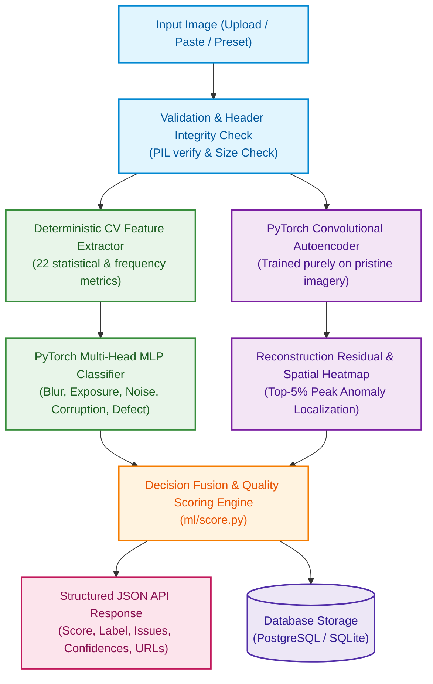

# AI-Powered Image Quality & Defect Detection System

[](https://fastapi.tiangolo.com)
[](https://pytorch.org)
[](https://reactjs.org)
[](https://docker.com)

A robust, production-grade full-stack AI/Computer Vision system that evaluates digital image quality, diagnoses multi-label degradations (blur, exposure defects, sensor noise, compression corruption), detects anomalous physical defects, and provides interpretable explanations via interactive spatial reconstruction heatmaps.

---

## 1. Problem Statement & System Overview

Digital image acquisition frequently suffers from optical, sensor, environmental, or transmission degradations. This system accepts user-uploaded images and delivers:
1. **Continuous Quality Index (0–100)** and categorical classification (`ACCEPTABLE`, `DEGRADED`, `DEFECTIVE`).
2. **Multi-Label Degradation Diagnosis** with calibrated per-issue severity (`low`, `medium`, `high`) and confidence score.
3. **Anomaly & Defect Localization** via deep convolutional autoencoder pixel-wise reconstruction residual heatmaps.
4. **Interpretable CV Diagnostics** exposing 22 deterministic statistical and frequency metrics.
5. **Full Persistence & Historical Audit Trail** backed by PostgreSQL / SQLite.
6. **Non-Generic Precision UI**: Industrial scientific inspection workbench avoiding common AI clichés (no pill shapes, no floating rainbow blur orbs).

---

## 2. Core Architecture & Hybrid AI Formulation

This solution implements a **hybrid AI + Computer Vision** pipeline combining deterministic signal processing with learned deep representations:



### Detection Capabilities & CV Metrics
* **Sharpness & Focus (4 metrics)**: Laplacian variance, Tenengrad Sobel gradients, FFT high-frequency energy ratio, Canny edge density.
* **Exposure & Dynamic Range (6 metrics)**: Mean luminance, crushed black pixel ratio (<10), clipped highlight ratio (>245), histogram skewness, RMS contrast, Michelson contrast.
* **Sensor Noise & Texture (6 metrics)**: Immerkær Laplacian $\sigma$ estimator, flat-region local variance, SNR proxy, GLCM contrast, GLCM homogeneity, GLCM energy.
* **Color & Compression (6 metrics)**: HSV mean saturation, RGB channel imbalance, Hasler colorfulness, 8×8 DCT boundary blockiness, high-frequency energy loss, compression gradient ratio.
* **Structural Anomalies**: Convolutional autoencoder top-5% spatial peak reconstruction error.

---

## 3. Evaluation Results Summary (Unseen Test Set)

Evaluated on **150 unseen test images** derived from 30 independent physical scenes excluded from training:

| Degradation Family | Accuracy | Precision | Recall | F1-Score | **ROC-AUC** |
|---|---|---|---|---|---|
| **Noise** | **100.0%** | **1.000** | **1.000** | **1.000** | **1.000** |
| **Overexposure** | **98.7%** | **0.920** | **1.000** | **0.958** | **0.999** |
| **Underexposure** | **98.7%** | **1.000** | **0.909** | **0.952** | **1.000** |
| **Corruption** | **89.3%** | **0.609** | **0.667** | **0.636** | **0.937** |
| **Blur** | **86.0%** | **0.452** | **0.778** | **0.571** | **0.949** |
| **Defect** | **80.0%** | **0.500** | **0.400** | **0.444** | **0.802** |
| **Macro Average** | **92.1%** | **0.747** | **0.792** | **0.760** | **`0.948` (94.8%)** |

*For complete confusion matrices, ROC curves, and the 6-case Failure Case Analysis, see [`docs/evaluation_report.md`](docs/evaluation_report.md).*

---

## 4. Repository Structure

```
├── backend/                  # FastAPI backend service
│   ├── app/
│   │   ├── db/               # SQLAlchemy engine & session management
│   │   ├── models/           # ORM models (AnalysisRecord)
│   │   ├── routers/          # REST routes (/api/analyze, /api/results, /api/health)
│   │   ├── schemas/          # Pydantic v2 schemas
│   │   ├── services/         # InferenceService & CV pipeline
│   │   └── main.py           # FastAPI entrypoint with Lifespan & CORS
│   ├── tests/                # Automated pytest suite (10/10 passing)
│   └── requirements.txt      # Pinned backend dependencies
├── frontend/                 # React 18 + Vite frontend application
│   ├── src/                  # Scientific workbench components & API client
│   └── package.json          # Frontend dependencies
├── ml/                       # Machine Learning and CV pipelines
│   ├── degrade.py            # Controlled synthetic degradation engine
│   ├── generate_dataset.py   # Dataset builder & manifest generator
│   ├── feature_extractor.py  # 22-metric deterministic extraction engine
│   ├── models/               # Model architectures and saved weights
│   ├── train_mlp.py          # Multi-label classifier training script
│   ├── train_autoencoder.py  # Anomaly autoencoder training script
│   ├── evaluate.py           # Test suite & confusion matrix generator
│   └── score.py              # Quality score derivation & decision fusion
├── data/                     # Dataset storage (raw, degraded, manifest.csv, features.csv)
├── docker/                   # Container definitions & Nginx reverse proxy
│   ├── Dockerfile.backend
│   ├── Dockerfile.frontend
│   └── nginx.conf
├── docs/                     # Evaluation report & visual performance charts
│   ├── evaluation_report.md
│   └── sample_images/
├── docker-compose.yml        # Multi-container orchestration (PostgreSQL + API + UI)
├── requirements.txt          # Root Python requirements
└── README.md                 # Project documentation
```

---

## 5. Quick Start & Local Setup

### Prerequisites
* Python 3.11+ (or 3.13)
* Node.js 18+ and npm
* Git

### Local Development Setup

#### 1. Backend Service
```bash
# Activate virtual environment
# Windows:
.\venv\Scripts\activate
# Linux/macOS: source venv/bin/activate

# Install dependencies
pip install -r backend/requirements.txt

# Run FastAPI backend
uvicorn backend.app.main:app --reload --host 0.0.0.0 --port 8000
```
* **API Documentation (Swagger UI)**: `http://localhost:8000/docs`
* **Health Check**: `http://localhost:8000/api/health`

#### 2. Frontend Application
```bash
cd frontend
npm install
npm run dev
```
* **Frontend UI**: `http://localhost:5173`

---

## 6. Docker Deployment (Recommended)

To run the complete stack (PostgreSQL 16 + FastAPI Backend + Nginx/React Frontend) with a single command:

```bash
docker compose up --build
```

* **Frontend Web Workbench**: `http://localhost`
* **Backend REST API**: `http://localhost:8000`
* **API Documentation**: `http://localhost:8000/docs`

---

## 7. Verification & Automated Testing

Run the full backend test suite:
```bash
pytest backend/tests -v
```
*Result: 10 passed in ~6 seconds (100% pass rate).*
