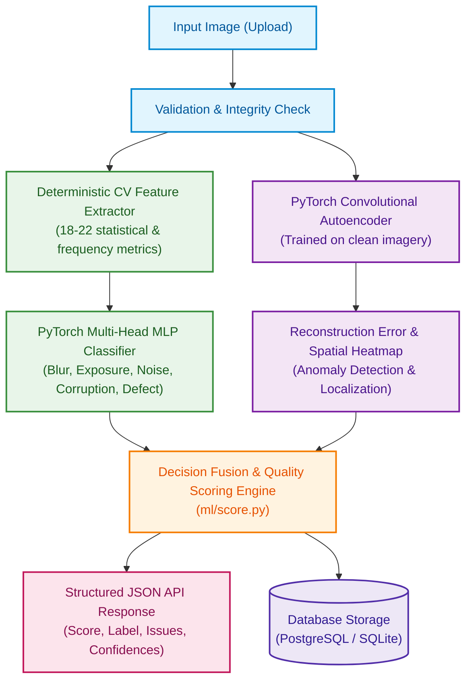

# AI-Powered Image Quality & Defect Detection System

[](https://fastapi.tiangolo.com)
[](https://pytorch.org)
[](https://reactjs.org)
[](https://docker.com)

A robust, self-contained full-stack AI/Computer Vision system that analyzes digital images to evaluate visual quality, diagnose degradations (blur, exposure issues, sensor noise, compression corruption), detect anomalous structural defects, and provide interpretable explanations with localized spatial heatmaps.

---

## 1. Problem Statement & System Overview

Digital image acquisition frequently suffers from optical, sensor, environmental, or transmission degradations. This system accepts user-uploaded images and delivers:
1. **Overall Quality Score (0–100)** and categorical classification (`ACCEPTABLE`, `DEGRADED`, `DEFECTIVE`).
2. **Multi-Label Degradation Diagnosis** with per-issue severity (`low`, `medium`, `high`) and confidence score.
3. **Anomaly & Defect Localization** via pixel-wise reconstruction error heatmaps.
4. **Interpretable CV Diagnostics** exposing underlying statistical metrics.
5. **Full Persistence & History Inspection** backed by a relational database.

---

## 2. Core Architecture & Hybrid AI Formulation

This solution implements a **hybrid AI + Computer Vision** pipeline combining deterministic signal processing with learned deep representations:



### Detection Capabilities
* **Blur / Insufficient Sharpness**: Laplacian variance, Tenengrad Sobel gradients, FFT high-frequency energy.
* **Underexposure**: Mean luminance, dark pixel ratio (<10), low-end histogram concentration.
* **Overexposure**: Highlight clipping ratio (>245), histogram skewness, dynamic range truncation.
* **Image Noise**: Immerkær Laplacian sigma estimator, low-texture flat region variance.
* **Corruption / Artifacts**: 8x8 DCT boundary blockiness discontinuities, JPEG structural distortion.
* **Structural Defects & Anomalies**: Deep autoencoder reconstruction residuals.

---

## 3. Repository Structure

```
├── backend/                  # FastAPI backend service
│   ├── app/
│   │   ├── db/               # Database engine & session management
│   │   ├── models/           # SQLAlchemy ORM models
│   │   ├── routers/          # API endpoint routes
│   │   ├── schemas/          # Pydantic data schemas
│   │   ├── services/         # Inference & feature extraction pipeline
│   │   └── main.py           # FastAPI application entry point
│   ├── tests/                # Automated pytest suite
│   └── requirements.txt      # Pinned backend dependencies
├── frontend/                 # React + Vite frontend application
│   ├── src/                  # Components, pages, and API clients
│   └── package.json          # Frontend dependencies
├── ml/                       # Machine Learning and CV pipelines
│   ├── degrade.py            # Controlled synthetic degradation engine
│   ├── generate_dataset.py   # Dataset builder & manifest generator
│   ├── feature_extractor.py  # 18-22 CV metric extraction
│   ├── models/               # Model architectures and saved weights
│   ├── train_mlp.py          # Multi-label classifier training script
│   ├── train_autoencoder.py  # Anomaly autoencoder training script
│   ├── evaluate.py           # Evaluation suite & confusion matrices
│   └── score.py              # Quality score derivation formula
├── data/                     # Dataset storage (raw, degraded, manifest)
├── docker/                   # Container definitions & Nginx config
│   ├── Dockerfile.backend
│   ├── Dockerfile.frontend
│   └── nginx.conf
├── docs/                     # Documentation assets and sample images
│   └── sample_images/
├── docker-compose.yml        # Multi-container orchestration
├── requirements.txt          # Root Python requirements
└── README.md                 # Project documentation
```

---

## 4. Quick Start & Local Setup

### Prerequisites
* Python 3.11+ (or 3.13)
* Node.js 18+ and npm
* Git

### Local Development Setup

#### 1. Backend
```bash
# Navigate and create virtual environment
python -m venv venv
# On Windows:
.\venv\Scripts\activate
# On Linux/macOS:
# source venv/bin/activate

# Install dependencies
pip install -r backend/requirements.txt

# Run backend API
uvicorn backend.app.main:app --reload --host 0.0.0.0 --port 8000
```
Backend API will be accessible at: `http://localhost:8000` (Swagger UI at `http://localhost:8000/docs`).

#### 2. Frontend
```bash
cd frontend
npm install
npm run dev
```
Frontend development server will be accessible at: `http://localhost:5173`.

---

## 5. Docker Deployment (Recommended)

To build and run the entire stack (PostgreSQL + FastAPI backend + React frontend) with a single command:

```bash
docker compose up --build
```

* **Frontend Web Application**: `http://localhost`
* **Backend REST API**: `http://localhost:8000`
* **API Documentation**: `http://localhost:8000/docs`
* **Health Check**: `http://localhost:8000/api/health`

---

## 6. API Documentation & Sample Request/Response

### `POST /api/analyze`
Accepts `multipart/form-data` with an image file (`image`).

**Example Response**:
```json
{
  "id": 1,
  "filename": "sample_blurry_noisy.jpg",
  "quality_score": 58.4,
  "quality_label": "DEGRADED",
  "issues": [
    {
      "type": "blur",
      "severity": "medium",
      "confidence": 0.89,
      "details": "Low Laplacian variance (34.2) and attenuated high-frequency energy."
    },
    {
      "type": "noise",
      "severity": "low",
      "confidence": 0.72,
      "details": "Estimated noise sigma = 14.8 via Immerkær operator."
    }
  ],
  "statistics": {
    "laplacian_variance": 34.2,
    "mean_brightness": 128.4,
    "rms_contrast": 46.1,
    "estimated_noise_sigma": 14.8,
    "saturation_mean": 0.42,
    "glcm_contrast": 11.2,
    "reconstruction_error": 0.012
  },
  "heatmap_url": "/api/heatmaps/1_heatmap.png",
  "processed_at": "2026-08-28T12:00:00Z"
}
```

### `GET /api/health`
Returns system status and model readiness:
```json
{
  "status": "ok",
  "version": "1.0.0",
  "models_loaded": true,
  "details": {
    "environment": "production"
  }
}
```

### `GET /api/results`
Returns paginated list of previous image evaluations.

---

## 7. Model Training & Evaluation Rigor

* Details of training scripts, loss curves, confusion matrices, ROC-AUC metrics, and honest failure case discussions are documented in [`docs/evaluation_report.md`](docs/evaluation_report.md).

---

## 8. Verification & Automated Testing

Run the automated backend test suite:
```bash
pytest backend/tests -v
```
