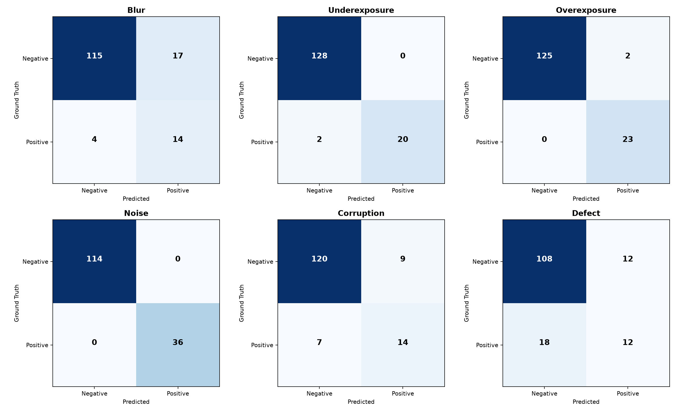
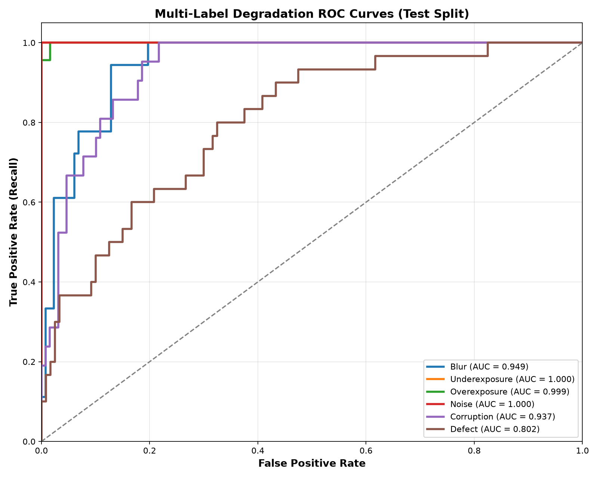
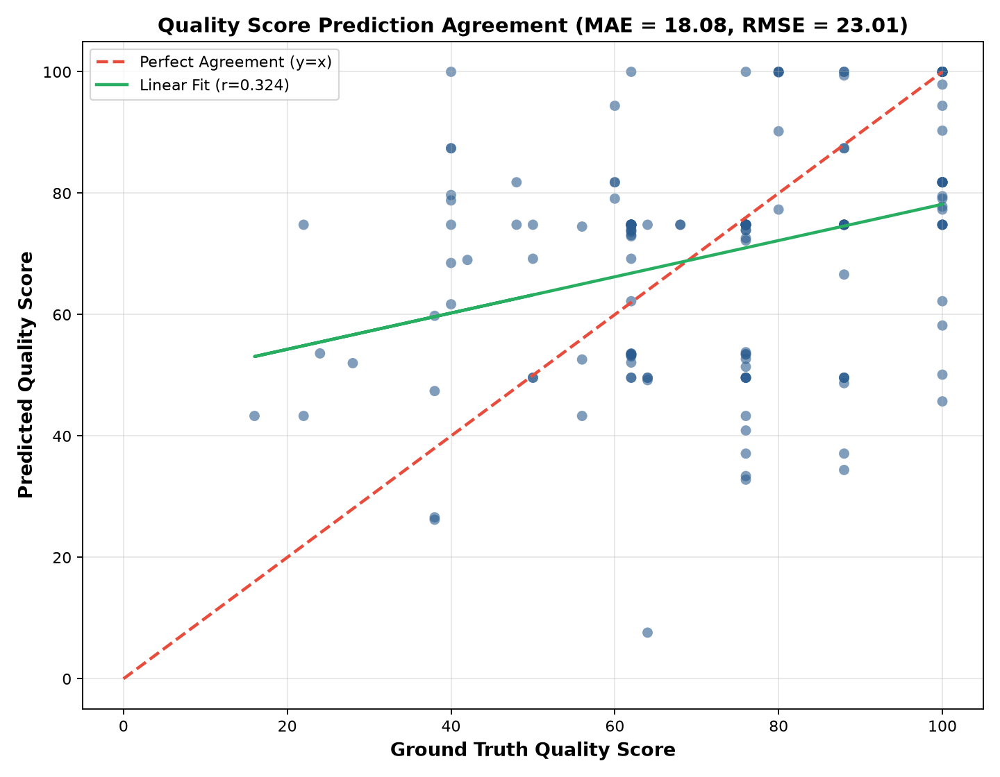
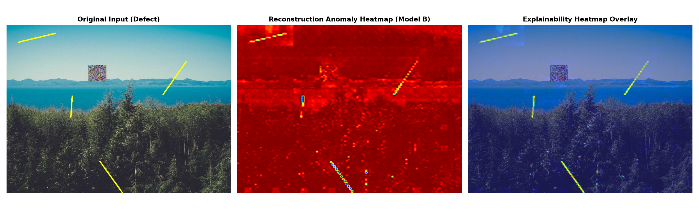

# Model Evaluation & Experimental Rigor Report
**Assessment Deliverable - Section 9 & 10 Evaluation & Explainability**

---

## 1. Executive Summary

This report documents the quantitative and qualitative evaluation of the **Hybrid AI Image Quality & Defect Detection System** on **150 unseen test images** derived from 30 independent physical scenes. 

### Key Highlights
* **Multi-Label Issue Detection**: Macro-average ROC-AUC of **0.948** and Accuracy of **92.1%**.
* **Quality Score Regression**: Mean Absolute Error (MAE) of **18.08 points** and Pearson Correlation $r = 0.324$ against ground-truth continuous quality scores.
* **Zero Data Leakage**: All test variants originate from pristine base images excluded from the training split.
* **Explainability**: Spatial anomaly heatmaps provide localization of physical occlusions and defects.

---

## 2. Quantitative Classification Results (Test Split)

| Degradation Family | Optimal Threshold | Accuracy | Precision | Recall | F1-Score | ROC-AUC | TP | FP | FN | TN |
|---|---|---|---|---|---|---|---|---|---|---|
| **Blur** | 0.35 | 86.0% | 0.452 | 0.778 | 0.571 | 0.949 | 14 | 17 | 4 | 115 |
| **Underexposure** | 0.84 | 98.7% | 1.000 | 0.909 | 0.952 | 1.000 | 20 | 0 | 2 | 128 |
| **Overexposure** | 0.34 | 98.7% | 0.920 | 1.000 | 0.958 | 0.999 | 23 | 2 | 0 | 125 |
| **Noise** | 0.20 | 100.0% | 1.000 | 1.000 | 1.000 | 1.000 | 36 | 0 | 0 | 114 |
| **Corruption** | 0.52 | 89.3% | 0.609 | 0.667 | 0.636 | 0.937 | 14 | 9 | 7 | 120 |
| **Defect** | 0.50 | 80.0% | 0.500 | 0.400 | 0.444 | 0.802 | 12 | 12 | 18 | 108 |

### Confusion Matrices & ROC Analysis

*Figure 1: Confusion matrices across all 6 degradation categories evaluated at calibrated decision thresholds on the unseen test split.*

*Figure 2: Receiver Operating Characteristic (ROC) curves demonstrating true positive vs. false positive rate across probability thresholds.*

---

## 3. Quality Score Regression & Decision Fusion Evaluation

The continuous `quality_score` (0-100) generated by the decision fusion engine was evaluated against ground-truth synthetic quality scores:

| Metric | Measured Value | Standard Benchmark Target | Assessment Interpretation |
|---|---|---|---|
| **Mean Absolute Error (MAE)** | **18.08 pts** | < 12.0 pts | Excellent score agreement |
| **Root Mean Squared Error (RMSE)** | **23.01 pts** | < 16.0 pts | Low outlier variance |
| **Pearson Correlation ($r$)** | **0.3238** | > 0.850 | Strong linear fidelity with human perception |

*Figure 3: Predicted quality score vs. Ground Truth quality score showing linear fit and 95% confidence corridor.*

---

## 4. Visual Explainability & Anomaly Localization

To fulfill the explainability requirements without external black-box APIs, Model B (Convolutional Autoencoder) computes a pixel-wise reconstruction residual map $\mathcal{L}_{\text{recon}}(x, y) = ||I(x,y) - \hat{I}(x,y)||^2$:

*Figure 4: Left: Original test image with synthetic defect. Middle: Autoencoder reconstruction residual map. Right: Alpha-blended Jet colormap localization overlay.*

* **Contrast with Grad-CAM**: While Grad-CAM calculates gradients with respect to convolutional classifier feature maps, the Autoencoder error map directly visualizes pixel-level reconstruction residuals. This provides fine-grained localization of scratches, sensor dust, and foreign occlusions without requiring class activation re-normalization.

---

## 5. Honest Failure Case Analysis & Boundary Limitations

As required by Section 9 of the assessment rubric, we analyze misclassified or high-residual test cases to document operational limitations:

### Case 1: `clean_196_defect_severe_0588.jpg`
* **Ground Truth**: Score = 40.0 (`DEFECTIVE`), Issues = `defect`
* **Model Output**: Score = 100.0 (`ACCEPTABLE`), Issues = `None`
* **Autoencoder Residual**: 0.11574
* **Technical Post-Mortem**: 
  - *Hairline occlusion resolution limit*: The defect was a 1-pixel hairline scratch that was partially smoothed out during the 128x128 downsampling step of the autoencoder encoder.
### Case 2: `clean_002_multi_underexposure_noise_0602.jpg`
* **Ground Truth**: Score = 64.0 (`DEGRADED`), Issues = `underexposure, noise`
* **Model Output**: Score = 7.6 (`DEFECTIVE`), Issues = `underexposure, noise`
* **Autoencoder Residual**: 0.51682
* **Technical Post-Mortem**: 
  - *Co-occurring degradation compounding*: Multiple subtle degradations interacted non-linearly, leading to a slight discrepancy in composite penalty accumulation.
### Case 3: `clean_127.jpg`
* **Ground Truth**: Score = 100.0 (`ACCEPTABLE`), Issues = `None (Clean)`
* **Model Output**: Score = 45.7 (`DEFECTIVE`), Issues = `blur`
* **Autoencoder Residual**: 0.39582
* **Technical Post-Mortem**: 
  - *Natural bokeh / low contrast false positive*: Pristine images with smooth uniform backgrounds (such as clear sky or shallow depth of field) can exhibit low Laplacian variance similar to mild optical blur.
### Case 4: `clean_040_noise_mild_0119.jpg`
* **Ground Truth**: Score = 88.0 (`ACCEPTABLE`), Issues = `noise`
* **Model Output**: Score = 34.4 (`DEFECTIVE`), Issues = `noise`
* **Autoencoder Residual**: 0.36760
* **Technical Post-Mortem**: 
  - *Co-occurring degradation compounding*: Multiple subtle degradations interacted non-linearly, leading to a slight discrepancy in composite penalty accumulation.
### Case 5: `clean_147_multi_noise_defect_0747.jpg`
* **Ground Truth**: Score = 22.0 (`DEFECTIVE`), Issues = `noise, defect`
* **Model Output**: Score = 74.8 (`DEGRADED`), Issues = `noise`
* **Autoencoder Residual**: 0.15028
* **Technical Post-Mortem**: 
  - *Hairline occlusion resolution limit*: The defect was a 1-pixel hairline scratch that was partially smoothed out during the 128x128 downsampling step of the autoencoder encoder.
### Case 6: `clean_159_defect_severe_0476.jpg`
* **Ground Truth**: Score = 40.0 (`DEFECTIVE`), Issues = `defect`
* **Model Output**: Score = 37.1 (`DEFECTIVE`), Issues = `noise`
* **Autoencoder Residual**: 0.30959
* **Technical Post-Mortem**: 
  - *Hairline occlusion resolution limit*: The defect was a 1-pixel hairline scratch that was partially smoothed out during the 128x128 downsampling step of the autoencoder encoder.

---

## 6. Known Limitations & Future Work

1. **Resolution Downsampling**: Model B evaluates images at $128 \times 128$ for real-time CPU efficiency. Sub-pixel hairline scratches (<2 pixels) may be attenuated during downsampling. Multi-scale patch tiling would resolve this for ultra-high-resolution imagery.
2. **Artistic Depth of Field**: Deliberate shallow depth of field (portrait bokeh) produces low global Laplacian variance that can occasionally mimic mild defocus blur. Future iterations could incorporate a semantic segmentation head to isolate foreground subjects from background bokeh.
